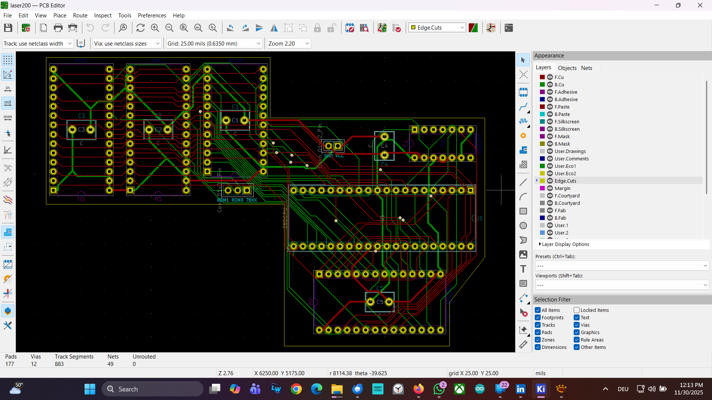
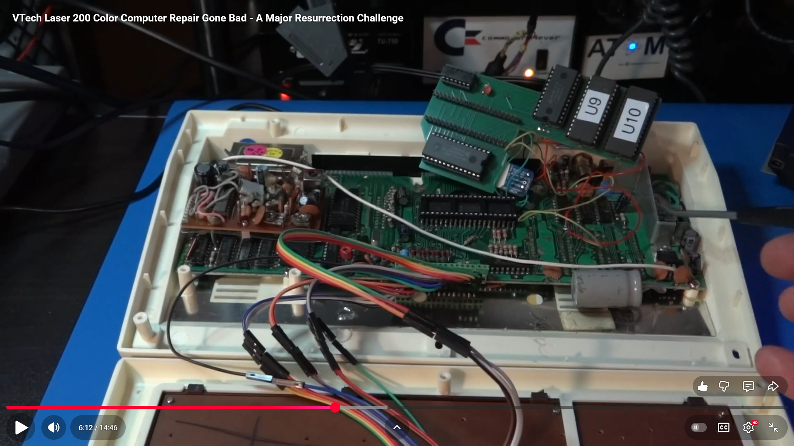
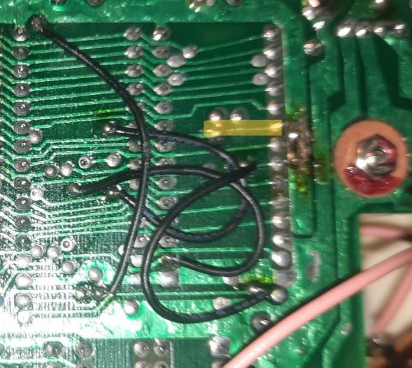
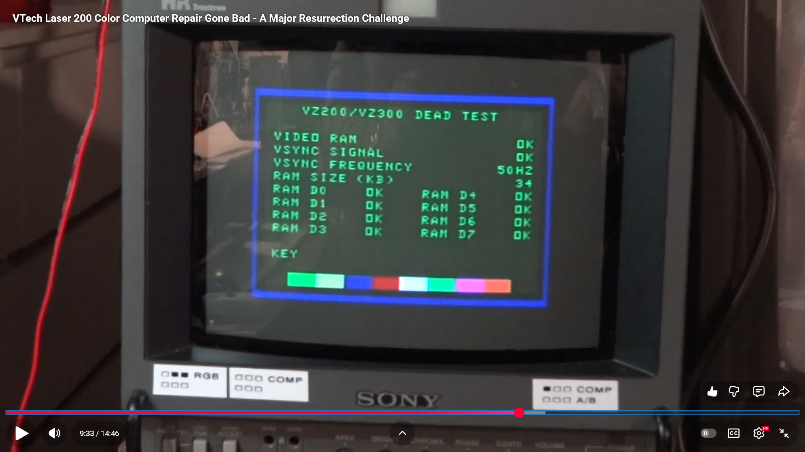

# Laser (VTech, Dick Smith, Sanyo Video Technologies, ...) VZ-200 Lazarus Daughter Board

## Background

Sometimes, VZ-200 repairs go really bad - if you have to remove the
6116 SRAM or ROM chips during a repair due to faulty RAM / ROM,
chances are that you are going to cause damage to the motherboard, as
the PCB quality is very low. So far, everybody attempting to remove
the ROM chips from the board has a least lifted a couple of pads
and/or damage some PCB traces, resulting in bodge-wires. 

 

In my case, the PCB got damaged so badly that I opted to create a
daughter board replacing the entire memory (RAM, ROM) sub-system with a
plugin daughter board - else, I would have needed two dozen of bodge
wires, and the chances of resurrecting the machine were close to zero.
However, the daughter board, replacing the entire memory sub-system,
brought my VZ-200 back to life! 

 

The Lazarus daughter board is mounted directly as a plug-in on top of the Z80.
Simply plug a DIP-40 *precision* socket onto the Z80, and apply some solder
to each Z80 pin, permanently connecting the socket to the Z80: 

 

The Lazarus board also contains a socket for an *optional 32 KB SRAM
upgrade* - populate `U7` with a `74LS00` NAND gate, and `U5` with a 32
KB `CY62256-70PC` SRAM chip. The credit for figuring out how to add
this 32 KB SRAM expansion to the VZ-200 goes to [Adrian
Black.](https://youtu.be/MnOnCbGJgRE) Note that I am not using a spare
gate on the VZ-200 motherboard, but `U7` instead.

You can find the [system ROM images for the two 2764 system ROMs
here.](http://www.vz200.org/bushy/software.html)

## Details 

Remove the 6116 SRAM chips as well as the two ROM chips from the
VZ-200 motherboard. As the motherboard is so delicate to work with,
one option might be to simply use a side cutter to "clip out" the
chips. That way you won't damage your motherboard by trying to
desolder the chips.

I also recommend to remove the black bodge wires and an "extra trace" 
that was added by the manufacturer to refactor the PCB - which was
originally designed for 28-pin ROMs (or 2764 EPROMs) - for 24-pin 
2364 EPROMS: 

More details about this can be found in [this excellent repository,
which includes re-created schematics in KiCAD, and even a  diagnostics
ROM.](https://github.com/rweather/vz200-restoration)

 

Note that you will need *three chip select lines from the
motherboard,* as these are not available from the Z80 CPU socket:
`ROM0`, `ROM1`, and `78XX`.  You can grab these from `U3` pin 4, pin
5, and pin 9, respectively - see [page 2
here](https://github.com/rweather/vz200-restoration/blob/main/schematics/VZ200/PDF/VZ200.pdf).

## Gerbers 

The Gerbers are [here.](gerbers/vz200-lazarus.zip)

## Video

Details can also be found in my [YouTube
video.](https://youtu.be/oaSFn2akLK8) 

### Please leave a "Star" if this project helped you to bring your VZ-200 back to life!

